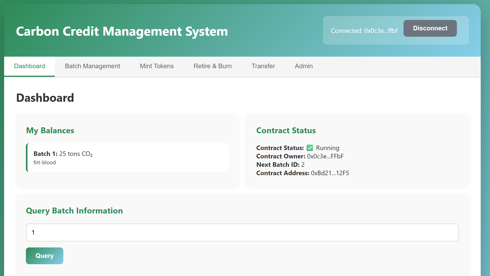

# RWA: Carbon credit token
## Requirements:
Make sure that you have installed:
Node.js
MetaMask
python 3

## How to start:
1. git clone this repo

2. deploy the carbon.sol file on the REMIX platform, choose the invironment "inject provider MetaMask"

3. run a terminal by the instruction below:
python -m http.server 8000

4. reach the website by this url:
http://localhost:8000/index.html

5. Then you can see the carbon credit token website



# 碳信用 RWA 管理平台介绍（中文）

这是一个用于管理碳信用 RWA（Real World Asset）代币化的前端应用，可以与部署在区块链上的智能合约进行交互。

## 功能特性

### 1. 仪表盘
- 查看当前账户的碳信用余额
- 查询批次详细信息
- 查看合约状态（暂停/运行、所有者、下一个批次ID等）

### 2. 批次管理
- **创建批次**：授权核证机构可以创建新的碳信用批次
- **核证批次**：核证机构可以核证自己创建的批次
- **查看所有批次**：浏览所有已创建的批次及其详细信息

### 3. 铸造代币
- 合约所有者可以为指定地址铸造碳信用代币
- 需要批次已核证且未过期

### 4. 注销销毁
- 持有者可以注销并销毁碳信用用于ESG抵消
- 支持添加ESG报告编号用于审计关联
- 永久销毁，不可恢复

### 5. 转账
- 在账户之间转移碳信用代币
- 使用ERC1155标准的safeTransferFrom方法

### 6. 管理员功能
- **授权核证机构**：合约所有者可以授权新的核证机构
- **暂停/恢复合约**：紧急情况下可以暂停或恢复合约
- **权限检查**：查看当前账户的权限状态

## 使用方法

### 1. 准备工作
- 确保已安装 MetaMask 浏览器扩展
- 确保 MetaMask 已连接到正确的网络（合约部署的网络）
- 合约地址：`0xBd214514bdDf69395f6cB69A26557c8C5F0612F5`

### 2. 启动应用
1. 在浏览器中打开 `index.html`
2. 点击"连接 MetaMask"按钮
3. 在 MetaMask 中确认连接

### 3. 使用功能
- **查看信息**：切换到"仪表盘"标签查看余额和合约状态
- **创建批次**：切换到"批次管理"，填写信息后点击"创建批次"（需要是授权核证机构）
- **核证批次**：在"批次管理"中输入批次ID，点击"核证批次"（需要是批次创建者）
- **铸造代币**：切换到"铸造代币"，填写接收地址、批次ID和数量（需要是合约所有者）
- **注销销毁**：切换到"注销销毁"，填写批次ID、数量和ESG报告编号（可选）
- **转账**：切换到"转账"，填写接收地址、批次ID和数量
- **管理员功能**：切换到"管理员"，可以授权核证机构、暂停/恢复合约

## 权限说明

### 合约所有者（Owner）
- 授权核证机构
- 铸造碳信用代币
- 暂停/恢复合约

### 授权核证机构（Verification Body）
- 创建碳信用批次
- 核证自己创建的批次

### 普通用户
- 查看批次信息
- 转账碳信用代币
- 注销销毁碳信用

## 技术栈

- **前端框架**：原生 HTML/CSS/JavaScript
- **区块链交互**：ethers.js v5
- **钱包连接**：MetaMask

## 文件结构

```
.
├── index.html          # 主HTML文件
├── styles.css          # 样式文件
├── app.js             # 主要JavaScript逻辑
├── abi_carbon.json    # 合约ABI
├── carbon.sol         # 智能合约源码
└── README.md          # 说明文档
```

## 注意事项

1. **网络要求**：确保 MetaMask 连接到合约部署的网络
2. **Gas费用**：所有交易都需要支付Gas费用
3. **权限检查**：某些功能需要特定权限，操作前请确认权限
4. **批次状态**：只有已核证且未过期的批次才能进行铸造和注销操作
5. **余额检查**：转账和注销前请确保账户有足够的余额

## 错误处理

应用会显示错误消息，常见错误包括：
- 权限不足
- 余额不足
- 批次未核证或已过期
- 网络连接问题
- 交易被拒绝

## 安全提示

- 永远不要分享你的私钥或助记词
- 在操作前仔细检查交易详情
- 确认合约地址正确
- 大额操作前建议先小额测试

## 开发说明

如果需要修改合约地址，请在 `app.js` 文件中修改 `CONTRACT_ADDRESS` 常量。

## 许可证

MIT License


